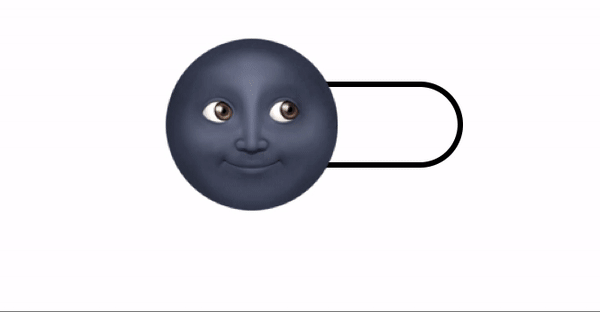
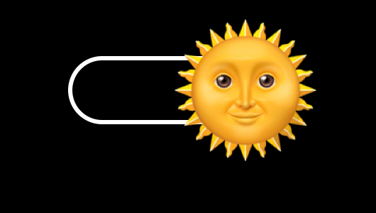
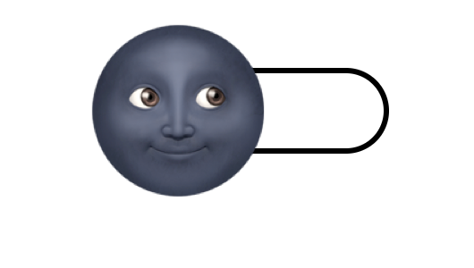

<div align="center">

# Reusable switcher web component



This component provides a control to switch between two possible states. In this case is used as an alternative for the checkbox element to chose between dark and light modes.
</div>

---

The switcher is positioned horizontally in big and medium devices and vertically in small devices of less than 500px.

<div align="center">



</div>

---

# Installation
This is single file, framework agnostic web component. You can copy it and use inside your project. It is easily customisable by modifing the CSS inside the <style></style> element. 

# Usage
```html
    <mode-switcher label="dark mode"></mode-switcher>
    
    <mode-switcher label="dark" include-label dark></mode-switcher>
   
```

# Attributes
| Name | Type | Description | 
| ---- | ---- | ----------- |
| label | String | label for the switcher | 
| checked | Boolean | current checked status for the switcher |
| disabled | Boolean | wether the switcher is interactable or not |

# Properties
| Name | Type | Description | Default |
| ---- | ---- | ----------- | -------- |
| includeLabel | Boolean | false | if true, text label will display next to the switcher component | false |

# Events
| Name | Type | Description |
| ---- | ---- | ----------- | 
| checked-changed | CustomEvent | emitted ever the checked status of the switcher changes

# Accessibility
Make sure the *label* attribute is provided to keep the component accesible.

# Notes
Feel free to copy and use, copy, and share this component. Attribution and constructive feedback are always appreciated.